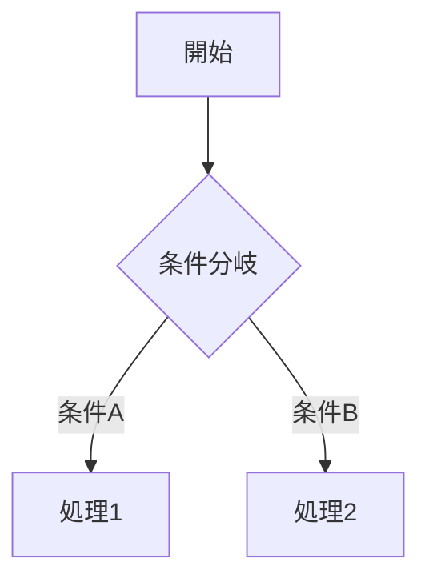

# コンポーネント設計書テンプレート

sf-analyst-cat4 が設計書を生成する際に参照するテンプレート。全種別共通のベース構造 + 実装種別ごとの追加指示を定義する。

---

## 設計書テンプレート（全種別共通・この順序で記述）

> **基本情報テーブルの値セル記載ルール（厳守）**: 値セルには確定値のみ記載する。FR/UC の照合根拠・旧採番・訂正経緯（「requirements.md に存在しない」「cat4 旧採番 UC-xx から訂正」等）を `（...）` で値セルに追記しない。訂正経緯を残す場合はセル外の `<!-- 訂正: 旧値 → 新値（理由） -->` HTML コメントへ。FR/UC の特定・訂正ルールは `cat4-common.md`「関連付けを明記する」を参照。[値セル記載原則](.claude/spec/sf-memory-quality.md#値セル記載原則差分更新横断補完共通)

```markdown
# 【{機能ID}】{コンポーネント名}（{API名}）

## 基本情報
| 項目 | 値 |
|---|---|
| 機能ID | {feature_ids.ymlの値} |
| 要件番号 | FR-xxx: {FRタイトル} |
| 実装種別 | Apex / Trigger / Flow / LWC / Aura / Visualforce / Batch / Integration |
| 担当オブジェクト | {主要な操作対象オブジェクト API名} |
| 関連UC | UC-XX: {UC名} |
| 処理タイミング | {いつ動くか: トリガー起動 / ボタン押下 / スケジュール等} |
| バージョン | {API Version or 作成日} |
| ソースファイル | `force-app/.../{FileName}` |
| 実装状態 | 実装済み / **[未実装]** / **[廃止]** |

## スコープ・ユーザーストーリー
As a {役割}, I want {目的}, so that {理由}.

（この機能が対応する業務上の問題・背景を記述）

## 実現方式

### 採用方式
（なぜこの実装方式を選んだか。代替案との比較）

| 方式 | 採用 | 理由 |
|---|---|---|
| {採用方式} | ✅ | {理由} |
| {代替案1} | ❌ | {非採用理由} |

### 処理フロー
（複数ステップがある場合は Mermaid flowchart TD で全分岐を図示。単純な1ステップは不要）



## メソッド一覧 / コンポーネント定義
（全量記述。省略不可）

| メソッド名 / プロパティ名 | 種別 | 引数 | 戻り値 | 説明 |
|---|---|---|---|---|

## データ設計

### 入出力
| 項目 | API名 | 型 | 入力/出力 | 説明 |
|---|---|---|---|---|

### SOQLクエリ一覧
（全SOQL。WHERE条件・ORDER BY・LIMITを明記）

| # | FROM句 | WHERE条件 | 目的 |
|---|---|---|---|

### DML操作一覧
| # | 操作 | オブジェクト | 件数目安 | 説明 |
|---|---|---|---|---|

## ロジック設計

### 主要処理の詳細
（分岐条件・計算式・変換ロジックを箇条書きまたは擬似コードで記述）

### 例外・エラー処理
| 例外ケース | 検出方法 | 対処 | ユーザーへの通知 |
|---|---|---|---|

## バリデーション
| 項目 | 条件 | エラーメッセージ |
|---|---|---|

## 権限設計
- 実行コンテキスト: `with sharing` / `without sharing` / System Mode
- 必要な権限: {オブジェクト権限・項目権限・カスタム権限}
- 制限事項: {アクセスできないケース}

## 影響範囲・依存関係
- 呼び出し元: {どのコンポーネント・ページ・フローから呼ばれるか}
- 呼び出し先: {このコンポーネントが呼ぶApex / Flow / 外部API}
- 影響するオブジェクト: {DML対象のオブジェクト一覧}
- 関連コンポーネント: {同一FG内の他コンポーネント}

## テスト観点
（正常系・異常系・境界値ごとにリストアップ）

- [ ] {テストシナリオ1}
- [ ] {テストシナリオ2}

## 未解決事項・要確認
- [ ] **[要確認]** {確認が必要な事項}

## 所見・注意点
（設計上の注意・既知のバグ・パフォーマンス懸念・手動追記歓迎）
```

---

## 実装種別ごとの追加指示

**Apex（クラス・トリガー）**:
- 全メソッドをメソッド一覧に記述（private含む）。エントリポイント（`@AuraEnabled` / `@InvocableMethod` / `@future` / トリガーハンドラ呼び出し）は★印で識別
- SOQL件数・DML件数・Callout回数を定量的に記述（例: SOQL 3件・DML 2件・Callout 2回）
- `with sharing` / `without sharing` の選択理由を権限設計に明記
- Trigger の場合: `before/after`・`insert/update/delete` の組み合わせと、各ハンドラメソッドの処理を全量記述
- バルク処理の考慮（ガバナ制限への対応）をテスト観点に必ず含める

**LWC**:
- 全 `@api`・`@track`・`@wire` デコレーター付きプロパティをプロパティ一覧に記述
- 公開メソッド（`@api` メソッド）・発火イベント（`dispatchEvent`）・受信イベント（`addEventListener`）を全量記述
- 「表示場所（ページ / App / Utility Bar等）・利用シナリオ」テーブルを基本情報に含める
- 親子コンポーネント関係を依存関係に明記（どのコンポーネントからこのLWCが使われるか）

**Flow**:
- `flow-meta.xml` を**全文読み込み**、全ノード（Start / Decision / Assignment / RecordCreate / RecordUpdate / ActionCall / SubflowRef等）をMermaid図で**全分岐図示**（省略不可）
  - 大規模 Flow（1000行超）も省略不可。`Read` の offset/limit で先頭から末尾まで 200〜300 行ずつ順次読み込み、全ノードを把握してから図示する。容量を理由に主要分岐・DML・Apex 呼び出しを `[要確認]` で放置しない
- 入力変数・出力変数を全量テーブルで記述（型・必須/任意・初期値）
- Apex呼び出し箇所（`<actionType>APEX</actionType>`）は対象クラス名を明記
- 起動条件（Record-Triggered の場合: オブジェクト・タイミング・条件式）を基本情報に記述
- **Scheduled Flow の場合**: `<scheduleStart>` / `<schedule>` ブロックから frequency / startDate / startTime / offsetNumber / offsetUnit を抽出し、基本情報の「処理タイミング」欄に **cron 相当の文字列**（例: `毎日 02:00 / 過去7日分の {Object} を対象`）を明記。Record-Triggered と Scheduled の混同に注意

**Batch / Schedule**:
- バッチサイズ（`Database.executeBatch` の scope）・cron式（`System.schedule` の cronExp）を基本情報に記述
- `start` / `execute` / `finish` 各フェーズをそれぞれフロー図で示す
- エラー時の挙動（失敗レコードの扱い・管理者通知）をエラー処理に明記
- 実行環境（本番 / Sandbox の違い・手動実行 vs スケジュール起動）を記述

**Integration（外部連携）**:
- エンドポイントURL・認証方式（Basic / OAuth / APIキー）・リクエスト/レスポンス形式（JSON / SOAP）をデータ設計に記述
- Timeout値・リトライ設定・エラーステータスコードの処理方針を例外処理に記述
- Named Credential名 or カスタム設定からの取得パターンを実現方式に記述
- 外部サービスのサンドボックス/本番切り替え方法を権限設計に記述

---

## Salesforce 標準プレースホルダの短縮ルール

`force-app/main/default/{classes,pages}/` 配下には、Salesforce 組織生成時に
自動配備されるプレースホルダ（Communities / Site / SelfReg / AnswersHome /
IdeasHome / SiteTemplate 等）が含まれる。これらは **業務ロジックを持たない
骨組みコード**であり、設計書を他機能と同じ粒度で書くと冗長になる。

以下に該当するコンポーネントは **短縮版テンプレート**を使う:

**該当条件**（いずれか該当すれば短縮版）:
- クラス名が Salesforce の標準プレースホルダ命名: `Communities*Controller` /
  `MicrobatchSelfRegController` / `SiteRegisterController` / `SiteLogin*` /
  `ChangePasswordController` / `ForgotPasswordController` 等
- ページ本体が実質空 or 1〜2行のプレースホルダ（例: `AnswersHome` / `IdeasHome` /
  `SiteTemplate` / `*Exception` / `FileNotFound` 等）
- javadoc に `"An apex page controller that..."` / `"An apex class that..."` 等の
  SF デフォルトボイラープレート英文が残存

**短縮版テンプレート**:

```markdown
# 【{機能ID}】{コンポーネント名}（{API名}）

## 基本情報
| 項目 | 値 |
|---|---|
| 機能ID | {feature_ids.ymlの値} |
| 実装種別 | Apex / Visualforce / Aura |
| 関連UC | **[推定]** UC-XX: {関連 UC 名} / なし（プレースホルダのため） |
| 実装状態 | 実装済み（**Salesforce 標準プレースホルダ**） / **[廃止]** |
| ソースファイル | `force-app/.../{FileName}` |

## 概要

このコンポーネントは Salesforce 組織生成時に自動配備される
**標準プレースホルダ**であり、業務ロジックを持たない。
{機能を担う実コンポーネント名} が本機能の実態を担うため、
詳細設計は {実コンポーネントの MD ファイル名} を参照。

## 削除・無効化の可否

- [ ] **[要確認]** 実運用で本クラス/ページを参照しているか（Experience Cloud /
  Site のコンフィグ・他 Apex からの参照）
- 削除可能と判断された場合: destructive deploy で `force-app/` から除去できる

## 所見

- {SFデフォルト javadoc の英文 or 空ページである旨を1〜2行で記載}
```

> **関連UC 欄は必ず残す**（`cat5` が FG 分類時に参照するため）。プレースホルダ自体が UC に紐づかない場合は「なし（プレースホルダのため）」と明記する。

本体の一般テンプレート（全セクション記述）は使わない。他機能の設計書から
参照される場合は「短縮版 MD 本体だけ」でよい。
